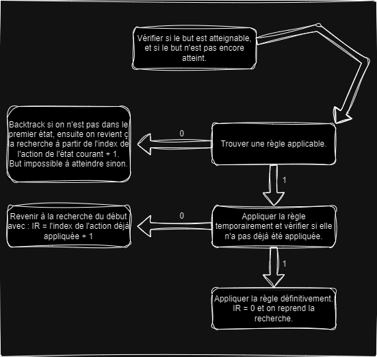

# General Problem Solver

Ce projet implémente un programme de raisonnement automatique permettant de résoudre divers problèmes en appliquant des règles sur un état initial pour atteindre un but spécifique. Ce solveur général est conçu pour explorer et appliquer des actions de manière systématique afin de trouver une solution, si elle existe.

## Objectif du projet

L'objectif de ce projet est de créer un programme capable de :
- Lire et analyser un fichier de règles et d'états initiaux/finals.
- Appliquer les règles et effectuer un raisonnement automatique pour atteindre l'état cible.
- Effectuer des retours en arrière (backtracking) si nécessaire pour explorer d'autres options lorsque le but ne peut pas être atteint directement.

## Fonctionnalités

- Chargement des règles depuis un fichier texte (ex: `monkey.txt`).
- Application des règles pour transformer l'état actuel vers un état objectif.
- Vérification de la réussite en comparant l'état courant à l'état cible.
- Retour en arrière (backtracking) pour tenter d'autres chemins si un blocage est rencontré.

## Structure du projet

- **`structures.h`** : Définit les structures de données utilisées pour les états, les règles et autres informations nécessaires.
- **`parseFunctions.h`** : Contient les fonctions pour parser les règles et les faits depuis un fichier.
- **`functions.h`** : Inclut les fonctions pour appliquer les règles, vérifier l'état final et gérer les opérations de backtracking.

## Fonctionnement de l'algorithme

L'algorithme de raisonnement suit un processus de backtracking et d'application de règles pour atteindre l'état final souhaité. Le schéma ci-dessous illustre les différentes étapes de l'algorithme.



1. **Vérifier l'état** : L'algorithme commence par vérifier si l'état actuel est le but ou si le but est atteignable.
2. **Trouver une règle applicable** : Ensuite, il cherche une règle qui peut être appliquée dans l'état actuel.
3. **Appliquer la règle temporairement** : Si une règle est trouvée, elle est appliquée temporairement pour vérifier si elle peut mener à un nouvel état valide.
4. **Backtracking** : Si aucune règle ne mène au but, l'algorithme effectue un retour en arrière (backtracking) pour essayer d'autres options.

## Utilisation

### Prérequis

Ce projet est écrit en C. Assurez-vous d'avoir un compilateur C installé (comme GCC) pour pouvoir exécuter le programme.

### Compilation

Compilez le projet en utilisant la commande suivante :
```bash
gcc main.c -o general_problem_solver
````
### Exécution

Pour exécuter le programme, lancez la commande suivante :
```bash
./general_problem_solver
````

Le programme démarre en affichant l'état initial. 
Ensuite, il applique les règles successives jusqu'à atteindre l'état final ou jusqu'à ce qu'il détermine que le but est impossible à atteindre. 
En cas de réussite, l'état final est affiché. 
En cas d'échec, un message indiquant l'impossibilité d'atteindre le but est affiché.
